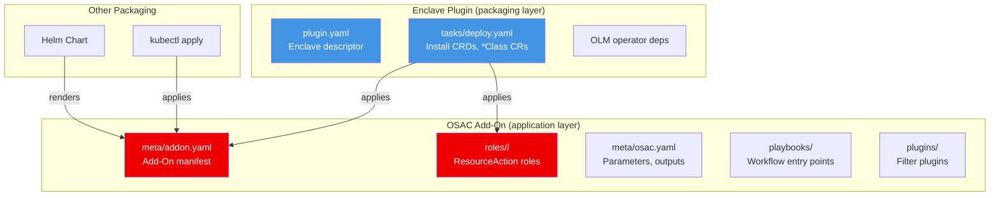
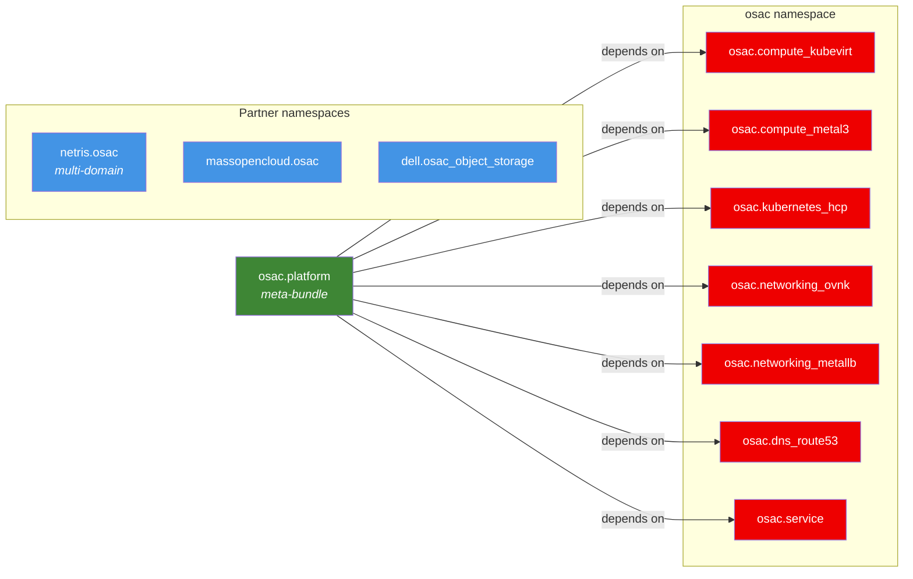
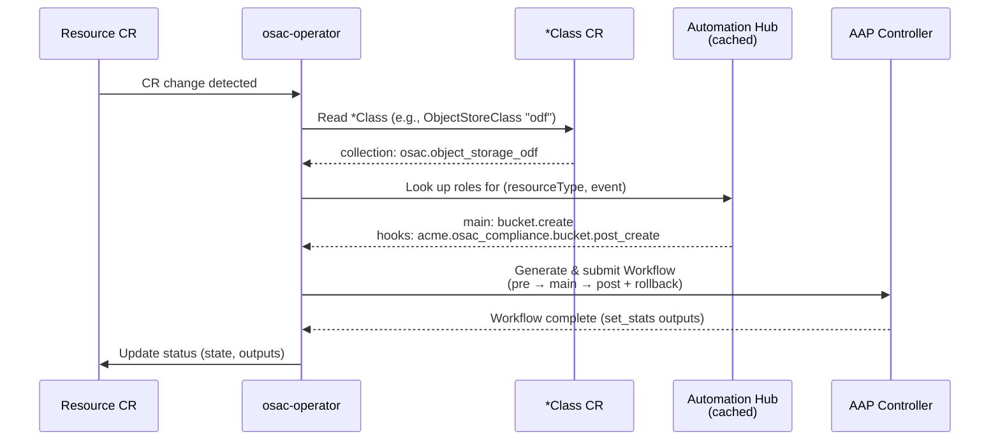
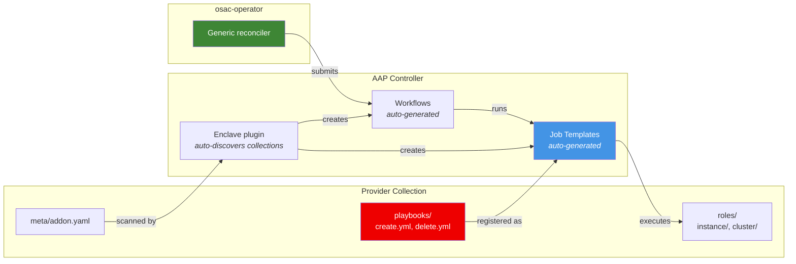
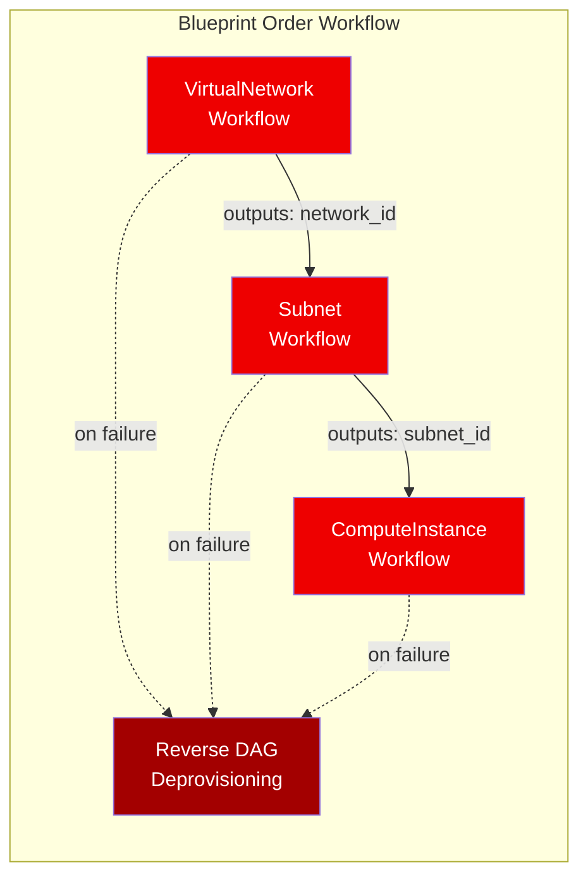
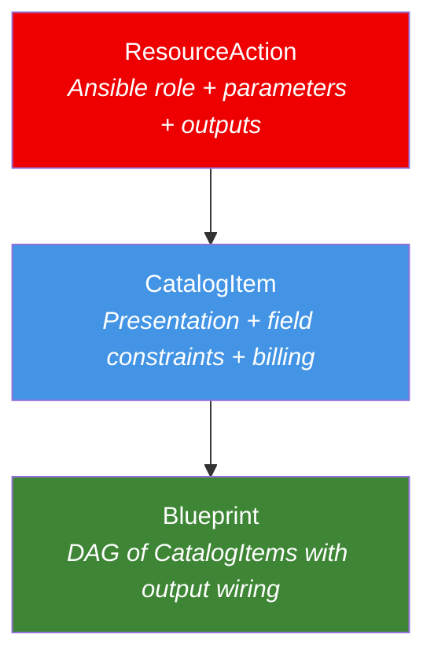

# OSAC Add-On Model

## Summary

Define the **OSAC Add-On** as a formal, packaging-agnostic
contract for extending OSAC with optional capabilities. The
contract is built on **Ansible collection conventions** — no
new CRDs are needed for extensibility. The operator discovers
add-on capabilities from collections published on Automation
Hub, using naming conventions and metadata files.

This EP covers:

1. **Add-On contract** — Ansible collection conventions,
   metadata schema, label convention, relationship to Enclave
   plugins
2. **Collection-per-provider model** — each provider ships its
   own Ansible collection, eliminating dispatcher roles and
   enabling independent partner lifecycle
3. **ResourceAction convention** — role naming and metadata
   that maps resource lifecycle events to Ansible roles,
   replacing hardcoded operator-to-AAP wiring and unifying
   with the Template concept
4. **Role I/O contract** — standardized inputs (parameters via
   `extra_vars`), outputs (via `set_stats`), and status
   reporting
5. **Compliance linting** — a validation tool that enforces
   the convention before publishing
6. **AAP integration convention** — self-contained collections
   with playbooks; Job Templates auto-generated from convention;
   no EDA
7. **Operator discovery** — cached dispatch table from
   Automation Hub
8. **AAP Workflow integration** — rollback-aware orchestration
   shared with Blueprints
9. **UI Plugin System** — Module Federation-based UI
   extensions (deferred to a later phase)

## Motivation

### Current state

OSAC is being decomposed into composable use-case plugins
([OSAC-30](https://redhat.atlassian.net/browse/OSAC-30)):
a core plugin plus per-use-case add-ons (CaaS, VMaaS, MaaS,
BMaaS). The plugin skeleton is being built
([OSAC-222](https://redhat.atlassian.net/browse/OSAC-222),
In Progress). The dependency model is being designed
([OSAC-291](https://redhat.atlassian.net/browse/OSAC-291)).

However:

- The operator hardcodes AAP role dispatch — add-ons cannot
  register provisioning logic without Go code changes.
- Templates (ClusterTemplate, ComputeInstanceTemplate) and
  lifecycle dispatch are separate concepts that could be
  unified.
- CatalogItems (not yet implemented) are designed to sit on
  Templates — aligning now avoids a future refactor.
- There is no rollback mechanism when provisioning fails.
- There is no validation that Ansible roles follow OSAC
  conventions.

### Problems

1. **No formal add-on contract.** Extensibility primitives
   exist but no contract for combining them.

2. **Hardcoded provisioning dispatch.** Every new resource type
   requires Go code changes in the operator.

3. **Template / dispatch fragmentation.** A Template is an
   Ansible role + parameters that creates a resource. A
   lifecycle dispatch is an Ansible role that runs on a CR
   event. Same thing, implemented separately.

4. **No rollback.** Failed provisioning leaves partial
   resources. AAP Workflows support compensating actions but
   OSAC doesn't leverage them.

5. **No convention enforcement.** Nothing validates that an
   Ansible collection follows OSAC conventions before
   publishing.

6. **No output contract.** Roles produce outputs
   (resource IDs, IPs) but there is no declared schema.
   Blueprints need declared outputs for cross-node wiring.

### Comparison with VMware Cloud Director

| Dimension | VCD | OSAC |
|---|---|---|
| Custom resource types | RDE (JSON Schema, runtime) | Resource (proto + GenericServer/GenericDAO) |
| Lifecycle dispatch | Behaviors → Webhook/MQTT/vRO/Lambda | ResourceAction → AAP role naming convention |
| Extensibility bundle | Solution Add-On (proprietary) | OSAC Add-On (Ansible collection with `meta/addon.yaml`) |
| Registration | API call to VCD | Publish collection to Automation Hub |
| Discovery | VCD internal registry | Operator queries Hub, caches dispatch table |
| Orchestration | vRO Workflows | AAP Workflow Job Templates |
| Rollback | Behavior error handling | AAP Workflow compensating nodes |
| Validation | VCD Schema validation | `osac-addon-lint` compliance tool |
| UI extension | Angular/Clarity plugins | React/PatternFly Module Federation (deferred) |
| Packaging | Proprietary bundle | Ansible collection (packaging-agnostic) |

### Beyond VCD: OSAC as a service delivery platform

The Add-On model makes OSAC applicable beyond the VCD IaaS
replacement scenario. For example, NVIDIA Cloud Partners (NCPs)
building GPU-as-a-service on GB200/GB300 NVL72 systems use OSAC
as the **service delivery layer** — defining GPU VM sizes,
managed Kubernetes clusters, and AI inference endpoints as
CatalogItems backed by ResourceAction roles in provider
collections. The NCP's service catalog (GPU-B200-4x, GPU-H100-8x,
Managed OpenShift with vLLM) is composed from:

- `osac.compute_kubevirt` — GPU VM provisioning with VFIO
  passthrough
- `osac.compute_metal3` — bare-metal GPU nodes with NVLink
  partition management
- `osac.kubernetes_hcp` — managed OpenShift clusters for AI
  workloads
- Partner collections (`netris.osac`, `massopencloud.osac`) —
  DPU networking, ESI bare-metal

Each NCP defines their service tiers as CatalogItems with locked
GPU configuration and pricing labels. The Add-On model enables
this without OSAC core changes — the NCP publishes their
provider collection, the linter validates it, and the Enclave
plugin deploys it.

### User Stories

- As an **OSAC core developer**, I want existing hardcoded
  dispatch and Templates expressed as conventional Ansible
  roles so that the operator uses a single discovery mechanism.

- As an **add-on developer**, I want to register provisioning
  logic by publishing an Ansible collection with the right
  naming convention, without modifying the operator.

- As an **add-on developer**, I want a linting tool that
  validates my collection before publishing, so I get early
  feedback on convention compliance.

- As a **CSP admin**, I want to add a post-provisioning
  compliance check by publishing a role with the right name.

- As a **tenant**, I want failed provisioning to roll back
  cleanly.

- As a **Blueprint author**, I want declared role outputs so
  I can wire them between nodes.

### Goals

- Define the OSAC Add-On as a convention-based contract
  centered on Ansible collections.
- Define ResourceAction as a role naming + metadata convention,
  not a CRD.
- Define the role I/O contract: parameters in, outputs out,
  status reporting.
- Provide a compliance linter for convention validation.
- Integrate with AAP Workflows for rollback.
- Unify Templates and lifecycle dispatch into ResourceActions.
- Align with OSAC-30 and OSAC-291.

### Non-Goals

- Dynamic resource type registration at runtime — feature-
  flagged compiled types work as interim.
- Implementing the UI plugin system now (deferred).
- Replacing AAP as the execution engine.
- Plugin marketplace beyond Automation Hub.
- Cross-resource orchestration — Blueprints handle that.

## Proposal

### Part 1: Add-On Contract

#### Two-Layer Model



**OSAC Add-On** (application layer) — an Ansible collection
that follows OSAC conventions:

- Collection-level metadata (`meta/addon.yaml`)
- Roles following the ResourceAction naming convention
- Per-role metadata (`meta/osac.yaml`)
- Resource type protos (compiled into fulfillment-service)
- CRDs (for osac-operator)

**Enclave Plugin** (packaging/delivery layer) — how an add-on
gets installed on infrastructure:

- `plugin.yaml` descriptor
- `tasks/` lifecycle (validate, deploy, post-validate)
- OLM operator dependencies
- Image mirroring

```
Ansible Collection (the add-on)
├── meta/addon.yaml           # add-on manifest
├── roles/
│   ├── object_store_bucket.create.main/
│   │   ├── meta/osac.yaml    # action metadata
│   │   └── tasks/main.yml   # provisioning logic
│   ├── object_store_bucket.delete.main/
│   │   ├── meta/osac.yaml
│   │   └── tasks/main.yml
│   └── ...
└── plugins/                 # optional Ansible plugins

Enclave Plugin (one packaging option)
└── tasks/deploy.yaml
    ├── Install CRDs
    ├── Create *Class CRs
    └── Ensure collection is on Automation Hub

Helm Chart (another packaging option)
└── templates/ → same artifacts

kubectl apply (simplest)
└── CRDs + *Class CRs manually
```

Key distinctions:

- The Ansible collection *is* the add-on. Publishing it to
  Automation Hub makes it discoverable.
- The Enclave plugin handles infrastructure concerns: CRDs,
  OLM operators, image mirroring.
- An Enclave plugin may or may not contain an OSAC Add-On
  (ODF, NVIDIA GPU are pure infrastructure).
- CaaS/VMaaS/MaaS/BMaaS (OSAC-289, OSAC-229, OSAC-237, OSAC-233) are OSAC Add-Ons.

#### Collection-Level Manifest: meta/addon.yaml

```yaml
# meta/addon.yaml in osac.object_storage_odf collection
name: osac-object-storage-odf
display_name: Object Storage (ODF)
description: S3-compatible object storage via OpenShift Data Foundation
version: 1.0.0

dependencies:
  osac_core: ">=0.1.0"
  operators:
    - name: odf-operator
      optional: false

resource_types:
  - name: ObjectStoreClass
    scope: provider
  - name: ObjectStoreBucket
    scope: tenant
  - name: ObjectStoreAccount
    scope: tenant

ui_plugin: osac-ui-plugin-object-storage  # optional, deferred
```

The collection itself is the add-on, and its metadata lives
inside the collection. Each provider collection has its own
`meta/addon.yaml` — `dell.osac_object_storage` would have a
separate manifest declaring Dell's dependencies and
capabilities.

#### Label Convention

All Kubernetes resources created by an add-on carry:

```yaml
labels:
  osac.io/addon: <addon-name>
```

#### CRD Permissions

- **CRD installation** is a packaging concern. The Enclave
  plugin or Helm chart installs CRDs with installer-level
  privileges (same as OLM).
- **The osac-operator** manages CR instances with wildcard
  RBAC on the `osac.io` API group:

```yaml
apiVersion: rbac.authorization.k8s.io/v1
kind: ClusterRole
metadata:
  name: osac-operator
rules:
  - apiGroups: ["osac.io"]
    resources: ["*"]
    verbs: ["*"]
```

### Part 2: Collection-Per-Provider Model

Each provider ships its own Ansible collection. There is no
dispatcher role — the *Class resource's `collection` field tells
the operator which collection to use, and the role naming
convention tells it which role to invoke. Each collection is
self-contained and independently versioned.



#### Collection naming convention

```
io.<org>.<domain>[.<product>]

OSAC-maintained (always OSAC-compatible):
  osac.compute_kubevirt
  osac.compute_metal3
  osac.networking_ovnk
  osac.networking_metallb
  osac.kubernetes_hcp
  osac.dns_route53
  osac.tenancy_keycloak
  osac.object_storage_odf
  osac.vpn_ovnk
  osac.vpn_wireguard
  osac.lb_envoy_gateway
  osac.lb_metallb

Partner-maintained (OSAC-compatible wrapper):
  netris.osac
  massopencloud.osac
  dell.osac_object_storage
  vast.osac_storage
  f5.osac_lb
```

OSAC-native collections live under `osac.*` and are always
OSAC-compatible. They are granular — one collection per domain
per provider — because they are maintained by different teams.

Partner collections use their own namespace with an `osac`
suffix to signal OSAC Add-On contract compliance. The suffix
distinguishes the OSAC-compatible wrapper from the partner's
general-purpose collection.

There is no `core` collection — every domain is a first-class
citizen with the same structure. The distinction between
"core" and "add-on" is about what ships by default, not a
structural difference.

#### Multi-domain partner collections

Partners are not required to match OSAC's granularity. A
partner whose product spans multiple domains (networking, DNS,
load balancing) can ship a **single collection** covering all
of them:

```
netris.osac/                    # one collection, multiple domains
├── meta/addon.yaml
├── roles/
│   ├── virtual_network/        # networking
│   │   ├── meta/osac.yaml       # resource_type: VirtualNetwork
│   │   └── tasks/
│   ├── subnet/                 # networking
│   │   ├── meta/osac.yaml       # resource_type: Subnet
│   │   └── tasks/
│   ├── load_balancer/          # lb
│   │   ├── meta/osac.yaml       # resource_type: LoadBalancer
│   │   └── tasks/
│   └── dns_record/             # dns
│       ├── meta/osac.yaml       # resource_type: DnsRecord
│       └── tasks/
```

The `meta/addon.yaml` declares all resource types the collection
covers:

```yaml
name: netris-osac
display_name: Netris OSAC Provider
version: 1.0.0
resource_types:
  - name: VirtualNetwork
    scope: tenant
  - name: Subnet
    scope: tenant
  - name: LoadBalancer
    scope: tenant
  - name: DnsRecord
    scope: tenant
```

Multiple *Class CRs reference the same collection:

```yaml
kind: NetworkClass
metadata:
  name: netris
spec:
  collection: netris.osac
---
kind: LoadBalancerClass
metadata:
  name: netris
spec:
  collection: netris.osac
---
kind: DnsClass
metadata:
  name: netris
spec:
  collection: netris.osac
```

The operator dispatch works identically — it looks up the role
matching the resource type in the collection, regardless of how
many domains the collection covers. Each role's `meta/osac.yaml`
declares its `resource_type`, so the operator knows which role
to invoke.

This flexibility means:
- One collection per partner is fine (less repos to maintain)
- Multiple collections per partner is also fine (if they prefer
  separation)
- OSAC-maintained collections stay granular (different teams)
- The convention doesn't force a particular granularity

#### *Class references a collection

```yaml
kind: ObjectStoreClass
metadata:
  name: odf
spec:
  collection: osac.object_storage_odf
  capabilities: [S3_COMPATIBLE, VERSIONING]
---
kind: NetworkClass
metadata:
  name: netris
spec:
  collection: netris.osac
  capabilities: [L2_ISOLATION, DUAL_STACK]
---
kind: VPNClass
metadata:
  name: ovnk
spec:
  collection: osac.vpn_ovnk
  capabilities: [SITE_TO_SITE, INTER_REGION]
```

#### Operator dispatch flow



```
Resource CR change detected
        │
        ▼
Read *Class referenced by resource
(e.g., ObjectStoreClass "odf")
        │
        ▼
Get collection from *Class
(e.g., osac.object_storage_odf)
        │
        ▼
Look up cached main-phase role in that collection
(e.g., bucket.create.main)
        │
        ▼
Look up hook roles from ALL discovered collections
matching (resourceType, event) with phase != main
(e.g., acme.compliance post_create hooks)
        │
        ▼
Sort all by phase (pre → main → post), then priority
        │
        ▼
Generate AAP Workflow, submit
```

The main-phase role comes from the *Class's collection. Pre/post
hooks come from any collection that registers roles for the same
resource type + event. This allows CSPs and partners to add
hooks without modifying the provider collection.

#### Why collection-per-provider

- **No dispatcher role.** Each collection handles one backend.
  No conditional logic, no provider parameter parsing.
- **Independent lifecycle.** Partners publish, version, and
  maintain their own collection. A Dell update doesn't require
  an OSAC release.
- **Independent validation.** The linter validates each
  collection independently.
- **Clear ownership.** `dell.osac_object_storage` is Dell's.
  `osac.object_storage_odf` is OSAC's. No shared collection.
- **Simpler roles.** Each role knows its backend. Simpler code,
  simpler tests.
- **Swappable providers.** A CSP swaps backends by pointing
  the *Class to a different collection. Same contract, different
  implementation.

### Part 3: ResourceAction Convention

#### Unifying Templates, Dispatch, and Hooks

Today OSAC has three related concepts:

| Concept | What it does | How it's configured |
|---|---|---|
| Template | Ansible role + parameters → provisions a resource | Proto message in DB, auto-discovered from AAP |
| Lifecycle dispatch | Ansible role → runs on CR event | Hardcoded in operator Go code |
| Hook (proposed) | Ansible role → runs pre/post lifecycle | Does not exist |

A Template *is* a `Create` main-phase ResourceAction with
parameter definitions. A hook is a `PostCreate` post-phase
ResourceAction. ResourceAction unifies all three as a **role
naming and metadata convention**.

Since CatalogItems are not yet implemented, this convergence
happens without migration cost.

#### Role Naming Convention

Within a collection, roles follow:

```
<resource>.<event>.<phase>
```

| Segment | Values | Example |
|---|---|---|
| `resource` | Short resource name (scoped by collection domain) | `instance`, `bucket`, `connection` |
| `event` | `pre_create`, `create`, `post_create`, `pre_update`, `update`, `post_update`, `pre_delete`, `delete`, `post_delete`, `signal` | `create` |
| `phase` | `pre`, `main`, `post` | `main` |

The resource name is short because the collection already
provides domain context. `bucket` inside
`osac.object_storage_odf` is unambiguous.

Fully qualified examples (collection + role):

```
# Compute (KubeVirt provider):
osac.compute_kubevirt
  instance.create.main
  instance.delete.main
  instance.signal.main

# Compute (Metal3 provider):
osac.compute_metal3
  instance.create.main
  instance.delete.main

# Networking (OVN-K provider):
osac.networking_ovnk
  virtual_network.create.main
  subnet.create.main
  security_group.create.main

# Cluster (HCP provider):
osac.kubernetes_hcp
  cluster.create.main
  cluster.delete.main

# Object storage (ODF provider):
osac.object_storage_odf
  bucket.create.main
  bucket.delete.main
  account.create.main
  account.delete.main

# VPN (OVN-K IPSec provider):
osac.vpn_ovnk
  connection.create.main
  connection.delete.main

# VPN (WireGuard provider):
osac.vpn_wireguard
  connection.create.main
  connection.delete.main

# Load balancer (Envoy Gateway provider):
osac.lb_envoy_gateway
  load_balancer.create.main
  target.create.main

# Partner provider (multi-domain):
netris.osac
  virtual_network.create.main
  subnet.create.main
  load_balancer.create.main

# Partner object storage:
dell.osac_object_storage
  bucket.create.main
  bucket.delete.main

# CSP compliance hook (any compute instance):
acme.osac_compliance
  instance.post_create.post

# Template replacement (parameterized create):
osac.compute_kubevirt
  rhel10_vm.create.main      # specific template role
  win2022_vm.create.main     # specific template role
```

#### Per-Role Metadata: meta/osac.yaml

Each role contains a `meta/osac.yaml` file declaring its
contract:

```yaml
# roles/bucket.create.main/meta/osac.yaml (in osac.object_storage_odf)
resource_type: ObjectStoreBucket
event: Create
phase: main
priority: 100
failure_policy: Fail

parameters:
  - name: quota_gb
    type: integer
    required: false
    default: 100
    description: Maximum bucket size in GiB
  - name: versioning
    type: boolean
    required: false
    default: false
    description: Enable S3 object versioning

outputs:
  - name: bucket_name
    type: string
    description: Created bucket name (tenant-prefixed)
  - name: endpoint
    type: string
    description: S3 endpoint URL
  - name: bucket_id
    type: string
    description: Internal bucket identifier

conditions: []
```

##### Fields

| Field | Type | Required | Description |
|---|---|---|---|
| `resource_type` | string | yes | OSAC resource type |
| `event` | enum | yes | Lifecycle event |
| `phase` | enum | yes | `pre`, `main`, `post` |
| `priority` | int | no | Ordering within phase (default 100) |
| `failure_policy` | enum | no | `Fail` (default) or `Ignore` |
| `parameters` | list | no | Input parameter definitions |
| `outputs` | list | no | Declared output schema |
| `conditions` | list | no | Run only when resource matches |

##### Parameters (Input Contract)

```yaml
parameters:
  - name: cores
    type: integer       # string, integer, boolean, float
    required: true
    default: null
    description: Number of CPU cores
    validation:
      minimum: 1
      maximum: 128
```

Parameters are passed to the role as `extra_vars`. For
ResourceActions that replace Templates, the parameters field
carries the same information as the current
`ParameterDefinition` proto message.

##### Outputs (Output Contract)

```yaml
outputs:
  - name: network_id
    type: string
    description: Created VirtualNetwork ID
  - name: subnet_id
    type: string
    description: Default subnet ID
  - name: gateway_ip
    type: string
    description: Gateway IP address
```

Roles report outputs via `set_stats`:

```yaml
# In the Ansible role:
- name: Report outputs
  ansible.builtin.set_stats:
    data:
      network_id: "{{ created_network.id }}"
      subnet_id: "{{ created_subnet.id }}"
      gateway_ip: "{{ created_network.gateway }}"
      osac_state: READY
      osac_conditions:
        - type: Provisioned
          status: "True"
```

##### Conditions

```yaml
conditions:
  - field: metadata.labels
    operator: Contains
    value: "gpu-enabled"
```

Conditions are ANDed. No conditions = always runs.

#### Template Replacement Example

A current `ComputeInstanceTemplate` for RHEL 10 becomes:

```yaml
# roles/rhel10_vm.create.main/meta/osac.yaml (in osac.compute_kubevirt)
resource_type: ComputeInstance
event: Create
phase: main
priority: 100
failure_policy: Fail

parameters:
  - name: cores
    type: integer
    required: false
    default: 4
    description: Number of CPU cores
  - name: memory_gib
    type: integer
    required: false
    default: 16
    description: Memory in GiB
  - name: boot_disk_gib
    type: integer
    required: false
    default: 100
    description: Boot disk size in GiB
  - name: image
    type: string
    required: true
    description: VM image reference

outputs:
  - name: instance_id
    type: string
    description: Created ComputeInstance ID
  - name: ip_address
    type: string
    description: Primary IP address
  - name: ssh_host
    type: string
    description: SSH-accessible hostname
```

The existing `publish_templates` AAP role evolves to publish
roles following this convention instead of calling the Template
API.

A CatalogItem references this role (by collection + role name)
and adds presentation: field locking, defaults, tenant
visibility, billing labels.

#### Priority Ranges (Convention)

| Range | Owner |
|---|---|
| 1–99 | OSAC core |
| 100–199 | First-party add-ons |
| 200–299 | CSP custom actions |
| 300+ | Partner / third-party |

### Part 4: Role I/O Contract

Every OSAC Ansible role follows a standard I/O contract:

#### Inputs (extra_vars)

| Variable | Source | Description |
|---|---|---|
| `osac_resource` | Operator | Full resource spec + metadata |
| `osac_resource_type` | Operator | Resource type name |
| `osac_event` | Operator | Lifecycle event |
| `osac_tenant` | Operator | Tenant identifier |
| Role-specific parameters | `osac.yml` defaults + CatalogItem overrides + tenant input | Defined in `parameters` |

#### Outputs (set_stats)

| Variable | Required | Description |
|---|---|---|
| `osac_state` | yes | Resource state (`READY`, `FAILED`, `DELETING`, ...) |
| `osac_conditions` | no | List of condition updates |
| Role-specific outputs | no | Declared in `outputs` |

#### Status Reporting

```yaml
- name: Report success
  ansible.builtin.set_stats:
    data:
      osac_state: READY
      osac_conditions:
        - type: Provisioned
          status: "True"
          reason: BucketCreated
          message: "Bucket created successfully"
      bucket_name: "acme-corp-ml-datasets"
      endpoint: "https://s3.osac.example.com"

- name: Report failure
  ansible.builtin.set_stats:
    data:
      osac_state: FAILED
      osac_conditions:
        - type: Provisioned
          status: "False"
          reason: QuotaExceeded
          message: "Tenant quota exceeded"
  when: provisioning_failed
```

The operator reads `set_stats` from the completed AAP job and
updates the resource status accordingly.

### Part 5: Compliance Linting

A validation tool enforces the convention before publishing:

```bash
osac addon lint osac.object_storage_odf
```

#### Checks

| Check | Description |
|---|---|
| **Naming** | Role names follow `<resource_type>.<event>.<phase>` |
| **Metadata** | `meta/osac.yaml` exists in every role with required fields |
| **Manifest** | `meta/addon.yaml` exists at collection level |
| **Parameters** | Valid types, descriptions present |
| **Outputs** | Every `Create` action declares at least an ID output |
| **Rollback** | Every `create.main` has a corresponding `delete.main` |
| **I/O contract** | Role uses `set_stats` for outputs and status |
| **Dependencies** | Referenced add-on/operator dependencies exist |

#### Pre-Publish Gate

Automation Hub supports approval workflows. The linter can run
as part of the approval pipeline, rejecting collections that
don't pass. This is the nudge: you can't publish to the `osac`
namespace on Hub without passing compliance.

```
Author → osac addon lint → Fix issues → Publish to Hub
                                              │
                                    Approval workflow runs linter
                                              │
                                    Pass → Available to operator
                                    Fail → Rejected with report
```

### Part 6: AAP Integration Convention



Each provider collection is self-contained — it carries its
playbooks and the operator (via config-as-code) auto-generates
AAP Job Templates from convention. No per-collection AAP
configuration is needed.

#### Collection structure

```
osac.compute_kubevirt/
├── meta/addon.yaml          # declares resource_types
├── roles/instance/          # ResourceAction roles
├── playbooks/               # workflow entry points
│   ├── create.yml           # → Job Template: <prefix>-compute-kubevirt-create
│   └── delete.yml           # → Job Template: <prefix>-compute-kubevirt-delete
└── plugins/filter/
```

#### Job Template generation rules

| Convention | Rule |
|---|---|
| **Name** | `<prefix>-<collection_name>-<playbook_name>` |
| **Playbook path** | `collections/ansible_collections/<ns>/<name>/playbooks/<playbook>.yml` |
| **Inventory** | Derived from domain: `compute` → `<prefix>-compute-operations`, `kubernetes` → `<prefix>-kubernetes-operations`, `networking` → `<prefix>-networking-operations` |
| **Instance group** | Same as inventory with `-ig` suffix |
| **EE** | Collection-level EE image (or default `<prefix>-ee`) |
| **Simultaneous** | Always `true` (multi-tenant concurrent jobs) |
| **Variables on launch** | Always `true` (operator passes resource spec) |

#### Config-as-code auto-generation

The Enclave plugin's deploy task discovers all installed
`osac.*` collections, reads `meta/addon.yaml`, scans
`playbooks/`, and auto-generates AAP Job Templates following
the conventions above. See
[OSAC-222](https://redhat.atlassian.net/browse/OSAC-222).

This eliminates per-provider Job Template definitions and makes
add-on onboarding automatic: install a collection, run the
Enclave plugin, Job Templates appear.

#### Playbook naming convention

| Playbook | Purpose |
|---|---|
| `create.yml` | Provision the resource |
| `delete.yml` | Deprovision the resource |
| `status.yml` | Report current state (optional) |
| `post_install.yml` | Post-provisioning configuration (optional) |

The linter validates:
- `playbooks/` exists if `resource_types` is non-empty
- `create.yml` and `delete.yml` exist as a pair
- Playbook names follow the convention

#### No EDA

The operator dispatches to AAP Job Templates directly. There
are no EDA entry-point playbooks. The operator passes flat
`extra_vars` following the Role I/O contract: `osac_resource`
(full K8s resource), `osac_resource_type`, and
`tenant_target_namespace`.

### Part 7: Operator Discovery and Caching

The operator discovers ResourceActions from Automation Hub at
startup and maintains a cached dispatch table.

#### Discovery Flow

```
Startup:
  Query Automation Hub API for collections matching osac.*
  (and configured partner namespaces)
        │
        ▼
  Parse meta/addon.yaml for each collection
        │
        ▼
  Parse meta/osac.yaml for each role
        │
        ▼
  Build dispatch table:
    (resourceType, event) → [actions sorted by phase+priority]
        │
        ▼
  Cache in memory
        │
        ▼
  Log discovered actions:
    INFO Discovered 16 ResourceActions from 7 collections:
    INFO   osac.compute_kubevirt: instance.create, instance.delete, ...
    INFO   osac.compute_metal3: instance.create, instance.delete, ...
    INFO   osac.kubernetes_hcp: cluster.create, cluster.delete, ...
    INFO   osac.networking_ovnk: virtual_network.create, subnet.create, ...
    INFO   osac.networking_metallb: public_ip.create, public_ip.delete, ...
    INFO   osac.dns_route53: record.create, record.delete
    INFO   netris.osac: virtual_network.create, subnet.create, ...
    INFO   massopencloud.osac: instance.create, cluster.create, ...
```

#### Refresh

- Periodic poll (configurable interval, default 5 minutes)
- Diff with cache, log additions/removals
- Webhook from Automation Hub on collection publish (if
  available)

#### Dispatch Flow

```
Resource CR change detected
        │
        ▼
Look up cached actions for (resourceType, event)
        │
        ▼
Filter by conditions (match resource labels/fields)
        │
        ▼
Sort by phase (pre → main → post), then priority
        │
        ▼
Generate AAP Workflow Job Template
        │
        ▼
Submit Workflow to AAP, monitor completion
        │
        ▼
Read set_stats outputs from completed jobs
        │
        ▼
Update resource status
```

### Part 8: AAP Workflow Integration and Rollback

ResourceAction dispatch generates an **AAP Workflow Job
Template**, not individual job launches.

#### Single-Resource Workflow

```
ComputeInstance.Create Workflow:
  ├── Node 1: pre-phase actions (sequential by priority)
  ├── Node 2: main-phase action (the provisioning role)
  ├── Node 3: post-phase actions (sequential by priority)
  └── On failure of main/post:
      └── Compensating node: run delete.main role
          (accepts outputs from create.main as inputs)
```

The compensating action receives the `create.main` outputs via
`set_stats` → `extra_vars` propagation between Workflow nodes.
This is how it knows what to tear down.

#### Blueprint Workflow (Shared Pattern)

Blueprint execution composes per-resource Workflows:



The code that builds a Workflow from ordered ResourceActions is
the **same code** that builds a Workflow from a Blueprint DAG.
This should be a shared library in osac-operator.

Declared outputs in `meta/osac.yaml` make Blueprint wiring
type-safe — the linter can validate that
`{{ network.outputs.subnet_id }}` references a declared output
at Blueprint authoring time.

#### Relationship to CatalogItems and Blueprints



- **ResourceAction** defines what can be provisioned, what
  parameters are available, what outputs are produced, and how
  lifecycle events are handled.
- **CatalogItem** wraps a ResourceAction with tenant-facing
  presentation: locked fields, defaults, published/unpublished,
  billing labels.
- **Blueprint** composes CatalogItems into a DAG. Node wiring
  references declared outputs.

### Part 9: UI Plugin System (Deferred)

This section specifies the UI plugin architecture for
completeness. **Implementation is deferred.** Add-ons function
fully without UI plugins — tenants use CLI and API.

#### Architecture

Plugins are discovered via labeled ConfigMaps and loaded using
Webpack Module Federation, following the OpenShift Console
dynamic plugin pattern.

#### Plugin Manifest (ConfigMap)

```yaml
apiVersion: v1
kind: ConfigMap
metadata:
  name: osac-ui-plugin-object-storage
  namespace: osac
  labels:
    osac.io/ui-plugin: "true"
    osac.io/addon: osac-object-storage
data:
  plugin.json: |
    {
      "name": "osac-object-storage",
      "version": "1.0.0",
      "displayName": "Object Storage",
      "requiredRoles": ["fulfillment-client"],
      "navigation": [
        {
          "label": "Object Storage",
          "path": "/object-storage",
          "icon": "StorageDomainIcon",
          "section": "storage",
          "order": 100
        }
      ],
      "remoteEntry": "/plugins/object-storage/remoteEntry.js",
      "exposedModules": {
        "BucketsPage": "./BucketsPage"
      },
      "extensions": [
        {
          "type": "page",
          "properties": {
            "path": "/object-storage",
            "component": "BucketsPage"
          }
        }
      ]
    }
```

#### Extension Types

| Type | Description |
|---|---|
| `page` | Full page at a route |
| `dashboard-widget` | Widget on the main dashboard |
| `action-button` | Action button on a resource page |
| `nav-item` | Navigation sidebar entry |

#### Requirements (When Prioritized)

- Migrate osac-ui from Vite to Webpack 5 (Module Federation).
- Data-driven routes and navigation.
- Plugin SDK (`@osac/plugin-sdk`).
- Role-based visibility via `requiredRoles`.
- Reference: OpenShift Console dynamic plugins.

## How to Build an OSAC Add-On

### Step 1: Create the Ansible Collection

```bash
ansible-galaxy collection init mycompany.osac_networking
```

### Step 2: Write meta/addon.yaml

```yaml
name: mycompany-networking
display_name: MyCompany Networking Provider
version: 1.0.0
dependencies:
  osac_core: ">=0.1.0"
resource_types:
  - name: VirtualNetwork
    scope: tenant
  - name: Subnet
    scope: tenant
```

### Step 3: Create Roles Following the Convention

```
roles/
├── virtual_network.create.main/
│   ├── meta/osac.yaml     # parameters, outputs, priority
│   └── tasks/main.yml    # provisioning logic
├── virtual_network.delete.main/
│   ├── meta/osac.yaml
│   └── tasks/main.yml
├── subnet.create.main/
│   ├── meta/osac.yaml
│   └── tasks/main.yml
└── subnet.delete.main/
    ├── meta/osac.yaml
    └── tasks/main.yml
```

### Step 4: Use set_stats for Outputs

```yaml
- name: Report outputs
  ansible.builtin.set_stats:
    data:
      osac_state: READY
      network_id: "{{ result.id }}"
      subnet_id: "{{ result.subnet_id }}"
```

### Step 5: Lint

```bash
osac addon lint mycompany.osac_networking
```

### Step 6: Publish

```bash
ansible-galaxy collection publish \
  mycompany-osac_networking-1.0.0.tar.gz
```

### Step 7: Create a *Class CR

```yaml
kind: NetworkClass
metadata:
  name: mycompany
  labels:
    osac.io/addon: mycompany-networking
spec:
  collection: mycompany.osac_networking
  capabilities: [L2_ISOLATION]
```

### Step 8: Package (Optional)

Create an Enclave plugin or Helm chart that installs CRDs,
*Class CRs, and ensures the collection is available on Hub.

### Step 9: Label Everything

```yaml
labels:
  osac.io/addon: mycompany-networking
```

## Risks and Mitigations

| Risk | Mitigation |
|---|---|
| Dynamic resource registration not in fulfillment-service | Feature-flagged compiled types as interim |
| Automation Hub API query at startup adds latency | Cached dispatch table; refresh on configurable interval |
| Naming convention is easy to get wrong | Compliance linter catches errors pre-publish; Automation Hub approval gate |
| AAP Workflow generation adds complexity | Shared library; Workflow provides rollback which direct launch cannot |
| Ordering conflicts between collections | Priority ranges by convention; linter warns on conflicts |
| Template → ResourceAction migration | Parallel operation: Templates continue to work; `publish_templates` evolves to create conventional roles |
| CRD installation requires cluster-admin | CRDs installed by Enclave/Helm, not operator; operator uses `*.osac.io` wildcard RBAC |
| UI plugin deferred | CLI + API fully functional |
| Collection versioning conflicts | `meta/addon.yaml` declares `osac_core` version dependency; operator validates at discovery |

## Test Plan

### ResourceAction Convention

- Linter unit tests: naming validation, metadata schema,
  output/rollback completeness.
- Integration tests: publish test collection to Hub, verify
  operator discovery and dispatch table.
- Rollback tests: fail main-phase, verify compensating Workflow
  node executes via `set_stats` output propagation.
- Condition-based filtering.
- Priority ordering across multiple collections.
- Template migration: verify roles created by `publish_templates`
  match convention and dispatch identically.

### Add-On Contract

- Deploy reference add-on (object storage) via Enclave plugin.
- Verify operator discovers actions from Hub.
- Verify label convention on all created resources.
- Uninstall: clean removal of all labeled resources.
- Deploy via Helm: verify identical behavior.

### UI Plugin System (When Implemented)

- ConfigMap discovery, dynamic routes, role-based visibility,
  Module Federation loading.

## Graduation Criteria

### Alpha

- Collection naming convention (`io.<org>.<domain>[.<product>]`)
  and role naming convention (`<resource>.<event>.<phase>`)
  finalized.
- `meta/osac.yaml` and `meta/addon.yaml` schemas finalized.
- Operator discovers actions from Automation Hub and caches.
- *Class `collection` field drives dispatch.
- Generic reconciler dispatches via cached table.
- `osac.compute_kubevirt` and `osac.networking_ovnk`
  collections published as first providers.
- `osac addon lint` validates naming, metadata, outputs.
- `*.osac.io` wildcard RBAC for operator.

### Beta

- All existing controllers migrated to generic reconciler.
- Template → ResourceAction migration for ClusterTemplate and
  ComputeInstanceTemplate.
- `publish_templates` role creates conventional roles.
- AAP Workflow generation with rollback.
- Object storage add-on as reference implementation.
- Shared Workflow generation library with Blueprints.
- Pre-publish approval gate on Automation Hub.
- Add-on developer guide.

### GA

- Remove hardcoded dispatch and Template API.
- CatalogItems reference ResourceActions (by collection + role).
- Metrics in Prometheus (discovery count, dispatch duration,
  failure rate per action).
- At least two add-ons validating the contract.
- Dynamic resource registration.

### Future

- UI plugin system implementation.
- Plugin SDK and scaffolding tool.
- Blueprint Workflow composed from ResourceAction Workflows.
